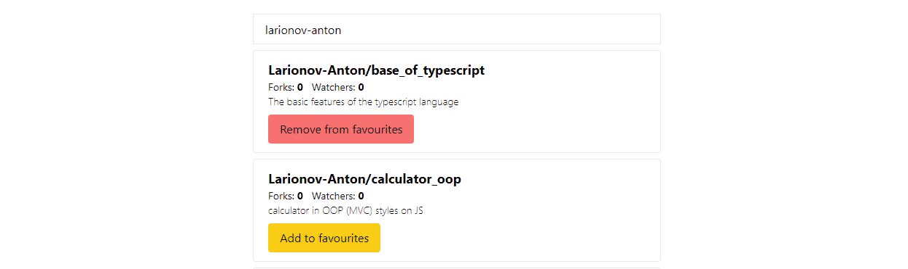

<!-- Блок краткой информации обо мне -->

	

		
		<h3> Larionov Anton (31 year) </h3>
		<h3> Frontend Web Developer </h3>
		<h3> Rostov-on-don </h3>
	

	

		<h2> About me </h2>
		
 Пишу проекты на стеке React \ Typescript \ Redux Toolkit \ Tailwind (CSS, SCSS) 

		
 В поиске IT вакансий и команды для совместной веб разработки. 

		
Из языков и технологий знаю:

			<ul>
			<li> <b>WEB</b> - клиент-сервер, протоколы - tcp\ip, dns, dhcp, http (get, post, put, delete, option) </li> 
			<li> <b>HTML</b> - структура документа, теги, атрибуты, формы, семантика </li> 
			<li> <b>CSS</b> - БЭМ, селекторы, свойства, классы, псевдоклассы, псевдоэлементы, каскадирование, наследование, приоритет, медиазапросы  </li> 
			<li> <b>SCSS</b> - переменные, вложенность, фрагментирование, миксины, расширение, мат.операторы</li> 
			<li> <b>JavaScript</b> - переменные, типы данных, операторы, условия, циклы, функции (рекурсия, замыкание, колбеки, промисы), классы, обьекты, прототипное наследование, this, работа с DOM, модули, обработка ошибок, паттерны (ООП, MVC) </li> 
			<li> <b>TypeScript</b> - типы данных, проверка типов, преобразование типов, generic, tuples, enum, alias, интерфейсы, модификаторы доступа </li> 
			<li> <b>React</b> - jsx разметка, рендеринг, компоненты, пропсы, состояние, контекст, обработчики событий, формы, списки и ключи </li> 
			<li> <b>Redux \ Toolkit</b> - store, actions, reducers, saga, slices, RTK Query, using with TypeScript </li> 
			<li> <b>GIT</b> - команды config, init, add, commit, reset, revert, rebase, clone, remote, push, pull, branch, checkout, merge, log </li> 
			<li> <b>Webpack</b> - точка входа\выхода, bundle, plugins, loaders, mode (dev,prod), dev server </li> 
			<li> <b>NodeJS</b> -  </li>
			<li> <b>Unit тестирование</b> -  </li> 
			</ul>
		
 Увлекаюсь йогой, плаванием, горным трекингом и игрой на музыкальных инструментах. 

	

<!-- Блок контактов -->

<h2>Follow me:</h2>

[_570_72_57-0189B4?style=flat&logo=apple&logoColor=D9D9D9>)](tel:+79885707257)

<!-- Блок стека технологий -->

<h2>Tech Stack:</h2>

-7A8573?style=flat&logo=javascript&logoColor=F7E01D>)

<h2>Tools:</h2>

<!-- Блок проекта - React, Redux Toolkit, Typescript  -->

<h1 class="startup__title">Portfolio</h1>
<h2><a target="_blank" href="https://react-advanced-taupe.vercel.app/">React, Redux Toolkit, Typescript</a></h2>

	
	

		<h3>About project</h3>
		
Github Search. React \ Redux Toolkit application on Typescript

		<ul>
			<li>Live search пользователя Github по его username. Асинхронные запросы при помощи RTK Query (createApi) для получения данных пользователя от Github api</li>
			<li>Обработка ошибок при запросах, индикатор процеса загрузки</li>
			<li>State manager - Redux Toolkit: configureStore, createSlice, createApi, useDispatch, useSelector</li>
			<li>Полученные данные рендерятся внутри функциональных компонентов React</li>
			<li>Реализованна функция добавления \ удаления ссылки на Github репозиторий в избранное с сохранением данных в Local Storage </li>
			</ul>
		

	

<!-- Блок проекта - React, Redux, JavaScript  -->

<h2><a target="_blank" href="https://redux-course.vercel.app/">React, Redux, Javascript</a></h2>

	
	

		<h3>About project</h3>
		
React \ Redux application on JavaScript

		<ul>
			<li>Асинхронные запросы при помощи redux-thunk для получения списка комментариев на api 'jsonplaceholder'</li>
			<li>Обработка ошибок при запросах, индикатор процеса загрузки</li>
			<li>Данные распределены через Redux: createStore, Actions, Action Creators, Reducers, Immutable Data, hooks 'useSelector', 'useDispatch', 'useState</li>
			<li>Полученные комментарии рендерятся внутри функциональных компонентов React</li>
			<li>Реализованна функции добавления\редактирования\удаления комментариев. Добавления лайков и дизлайков </li>
			</ul>
		

	

<!-- Блок проекта - React application -->

<h2><a target="_blank" href="https://react-course-bay.vercel.app/">React application on TypeScript</a></h2>

	
	

		<h3>About project</h3>
		
React application on TypeScript

		<ul>
			<li>Асинхронные запросы при помощи Axios для получения списка товаров на 'fakestoreapi'</li>
			<li>Асинхронные запросы реализованны при помощи кастомного хука</li>
			<li>Полученные товары рендерятся внутри функциональных компонентов React: components, state, hooks, props, jsx, event handlers </li>
			<li>Данные приложения распределятся React Context и строго типизированны TypeScript</li>
			<li>Роутинг страниц - 'react-router-dom'</li>
			<li>Реализованна кнопка "Показать Детали" через хук useState</li>
			<li>Реализованна возможность добавить собственный товар передав заголовок через асинхронный запрос на 'fakestoreapi'</li>
			</ul>
		

	

<!-- Блок проекта - Calculator OOP\MVC -->

<>

<h2><a target="_blank" href="https://larionov-anton.github.io/calculator_oop/dist/">Calcuator (OOP/MVC)</a></h2>

	
	

		<h3>About project</h3>
		
Calculator on JavaScript (OOP/MVC)

		<ul>
			<li>Классический калькулятор c iphone, выполняющий базовые математические операции</li>
			<li>Проект собирается самописной сборкой webpack</li>
			<li>Структура проекта составлена в соответствии с паттерном MVC в объектно-ориентированном стиле</li>
			<li>Вся логика написана на ванильном JavaScript</li>
			<li>Данные приложения сохраняются в local storage</li>
			</ul>
		

	

<!-- Блок проекта - Todo JS -->

<h2><a target="_blank" href="https://larionov-anton.github.io/todo_js/public/">Todo JS (OOP\MVC)</a></h2>

	
	

		<h3>About project</h3>
		
Todo list on JavaScript (OOP/MVC)

		<ul>
			<li>Структура проекта составлена в соответствии с паттерном MVC в объектно-ориентированном стиле</li>
			<li>Вся логика написана на ванильном JavaScript</li>
			<li>События данных реализованны через Event Emmiter</li>
			<li>Приложение умеет: добавлять, редактировать, отмечать как выбранные и удалять задачи</li>
			<li>Данные приложения сохраняются в local storage</li>
			</ul>
		

	

<!-- Блок проекта - Landig page startup -->

<h2><a target="_blank" href="https://larionov-anton.github.io/startup/">Startup</a></h2>

	
	

		<h3>About project</h3>
		
Landing Page

		<ul>
			<li>Префиксы под все современные браузеры</li>
			<li>Адаптив по брейк пойнтам под любые устройства </li>
			<li>Full screen блок главного экрана</li>
			<li>2 слайдера реализованный при помощи библиотеки slick slaider</li>
			<li>Блок с табуляцией</li>
			<li>Форма с валидацией</li>
			<li>Блог</li>
			</ul>
		

	

<!-- Блок проекта - Тестовое задание по верстке Rocket_Business -->

<h2><a target="_blank" href="https://larionov-anton.github.io/test_Rocket_Business/">Multidisciplinary clinic</a></h2>

	
	

		<h3>About project</h3>
		
Тестовое задание по верстке

		<ul>
			<li>Popup c формой на JavaScript</li>
			<li>Форма с валидацией маской ввода на JavaScript</li>
			<li>Отправка формы на почту (PHPmailer)</li>
			<li>Слайдер с счетчиком слайдов на JQ (SlickSlider)</li>
			<li>Адаптивное выпадающее мобильное меню на JavaScript</li>
			<li>Flexbox</li>
			<li>Использование относительных единиц EM</li>
			<li>Префиксы под все современные браузеры</li>
			<li>Адаптив по брейк пойнтам под любые устройства </li>
			</ul>
		

	

<!-- Блок проекта - Тестовое задание по верстке Elon Musc -->

<h2><a target="_blank" href="https://larionov-anton.github.io/Elon_Musc/">Elon Musc</a></h2>

	
	

		<h3>About project</h3>
		
Тестовое задание по верстке

		<ul>
			<li>Flexbox</li>
			<li>Градиенты</li>
			<li>Различное позиционирование элементов</li>
			<li>Адаптивное выпадающее меню</li>
			<li>Использование относительных единиц EM</li>
			<li>Префиксы под все современные браузеры</li>
			<li>Full screen блок главного экрана</li>
			<li>Адаптив по брейк пойнтам под любые устройства </li>
			</ul>
		

	

<!-- Подвал сайта -->

<footer>
	<h2>Larionov Anton © 2022</h2>
	<h3>Frontend Web Developer</h3>
	<h3>Rostov-on-don</h3>
</footer>
