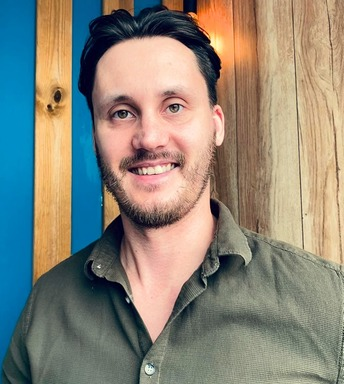

<h3> About me </h3>

Я Frontend developer. Верстаю лендинги и небольшие статические сайты. Углубленно изучаю Java Script, jQuery & React.

В настоящее время ищу работу в IT компании и команду для совместной веб разработки.

В свободное время занимаюсь йогой, играю на гитаре, африканском барабане джембе,  и горным трекингом.

<h3>Follow me:</h3>

[_570_72_57-7A8573?style=flat&logo=apple&logoColor=D9D9D9)](tel:+79885707257)

<h3>Tech Stack:</h3>

<h3>Tools:</h3>

<h2 class="portfolio-title">Portfolio</h2>
<h3><a href="https://larionov-anton.github.io/startup/" class="project-title">Startup</a></h3>

<h3 class="project-title">About project</h3>

Одностраничный лендинг

<ul>
<li>Префиксы под все современные браузеры</li>
<li>Адаптив по брейк пойнтам под любые устройства </li>
<li>Full screen блок главного экрана</li>
<li>2 слайдера реализованный при помощи библиотеки slick slaider</li>
<li>Блок с табуляцией</li>
<li>Форма с валидацией</li>
<li>Блог</li>
</ul>

